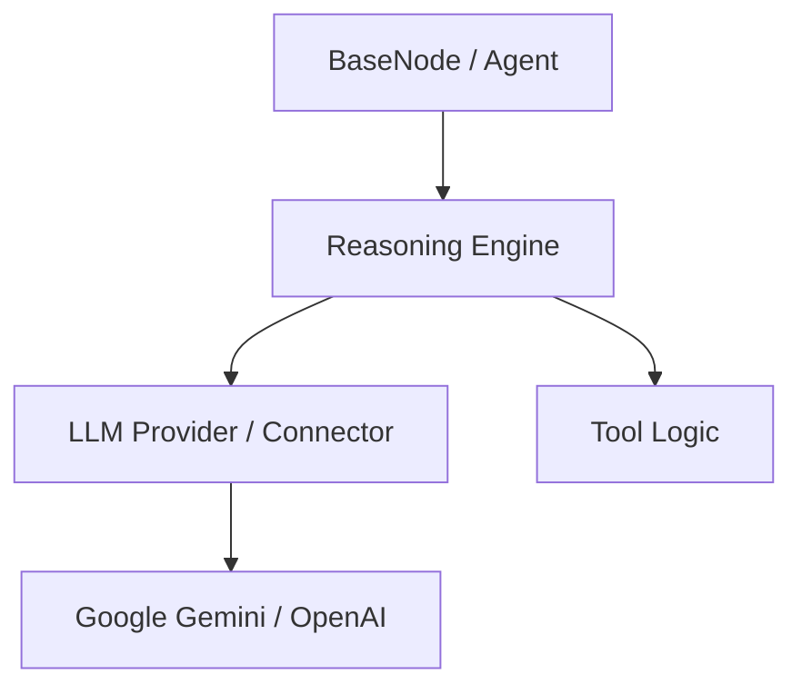

# LLM Reasoning & Provider Architecture

This document describes the design of VisionArk's LLM interaction layer, focusing on the separation of concerns between raw model connectivity and high-level reasoning orchestration.

## Overview

VisionArk uses a decoupled architecture to manage LLM interactions. The system is divided into two primary layers:
1. **LLM Connectors (Providers)**: Strictly stateless wrappers for external APIs (Gemini, OpenAI, etc.).
2. **Reasoning Engine**: An orchestrator that manages multi-turn tool calling and conversational state.

---

## 1. LLM Connectors (Providers)

Providers are located in `core/backend/llm/`. They implement the `BaseLLMProvider` interface and are responsible for:
- Translating `VisionArk.Message` objects to/from provider-specific formats (e.g., Google Generative AI `Content`, OpenAI `chat_messages`).
- Handling raw API authentication and communication.
- Returning a single-turn `CompletionResponse`.

### Key Principle: Single-Turn Focus
Providers are **stateless** and **single-turn**. They do not execute tools or maintain a `while` loop for multi-turn reasoning. If a model generates a function call intent, the provider simply returns that intent as part of the message results.

---

## 2. Reasoning Engine

The `ReasoningEngine` (in `core/backend/llm/reasoning_engine.py`) is the centralized orchestrator for "LLM-in-the-loop" execution.

### Responsibilities
- **Reasoning Loop**: Manages the `while turn < max_turns` loop required for tool-calling agents.
- **Tool Execution**: Dispatches and executes Python functions requested by the model.
- **State Management**: Appends messages and tool results to the conversation history for subsequent turns.
- **Status Orchestration**: Provides user-facing status updates (e.g., "Searching...", "Computing...") during the loop.

### Why this separation exists
- **Provider Consistency**: Connectors for Gemini, OpenAI, and Anthropic remain simple and interchangeable. The complex logic of "how to call a tool and feed the result back" is written once in the Engine.
- **Responsibility Isolation**: Low-level communication logic is separated from high-level application logic (tool execution, task cancellation, database sessions).

---

## 3. Explicit System Instructions

Modern models distinguish between **System Instructions** (static persona/directives) and **Message History** (dynamic conversation). 

- **Interface**: The `BaseLLMProvider` explicitly takes a `system_instruction: str` parameter.
- **Implementation**: 
    - **Gemini**: Uses the native `system_instruction` configuration.
    - **OpenAI**: Automatically prepends a `system` role message to the outgoing payload.

---

## 4. Message Model

The `Message` dataclass (in `models/message.py`) serves as the unified transport for all layers.

- **`role`**: `USER`, `ASSISTANT`, `SYSTEM`, or `TOOL`.
- **`content`**: The text payload.
- **`tool_calls`**: A list of `ToolCall` objects representing either intents (from the model) or results (from the Engine).

---

## Summary of Execution Flow

1. **Agent Node** calls `chat_with_tools`.
2. **BaseNode** instantiates `ReasoningEngine`.
3. **ReasoningEngine** calls **LLM Provider** for turn 1.
4. **LLM Provider** returns a "Function Call" intent.
5. **ReasoningEngine** executes the Python function.
6. **ReasoningEngine** passes the result back to **LLM Provider** for turn 2.
7. **LLM Provider** returns the final text response.
8. **ReasoningEngine** returns the unified history to the **Agent Node**.
