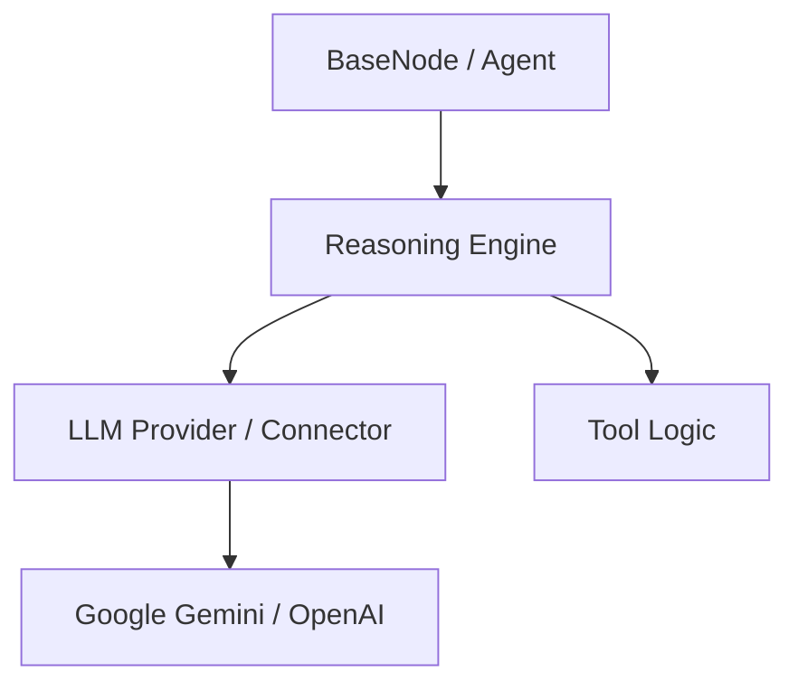

# LLM Reasoning & Provider Architecture

This document describes the design of VisionArk's LLM interaction layer, focusing on the separation of concerns between raw model connectivity and high-level reasoning orchestration.

## Overview

VisionArk uses a decoupled architecture to manage LLM interactions. The system is divided into two primary layers:
1. **LLM Connectors (Providers)**: Strictly stateless wrappers for external APIs (Gemini, OpenAI, etc.).
2. **Reasoning Engine**: An orchestrator that manages multi-turn tool calling and conversational state.

---

## 1. LLM Connectors (Providers)

Providers are located in `core/backend/llm/`. They implement the `BaseLLMProvider` interface and are responsible for:
- Translating `VisionArk.Message` objects to/from provider-specific formats (e.g., Google Generative AI `Content`, OpenAI `chat_messages`).
- Handling raw API authentication and communication.
- Returning a single-turn `CompletionResponse`.

### Key Principle: Single-Turn Focus
Providers are **stateless** and **single-turn**. They do not execute tools or maintain a `while` loop for multi-turn reasoning. If a model generates a function call intent, the provider simply returns that intent as part of the message results.

---

## 2. Reasoning Engine

The `ReasoningEngine` (in `core/backend/llm/reasoning_engine.py`) is the centralized orchestrator for "LLM-in-the-loop" execution.

### Responsibilities
- **Reasoning Loop**: Manages the `while turn < max_turns` loop required for tool-calling agents.
- **Thought Accumulation**: Captures each intermediate turn (thoughts + tool actions) as a structured `SubMessage`.
- **Tool Execution**: Dispatches and executes Python functions requested by the model.
- **Consolidation**: Merges multi-turn reasoning into a single `assistant` message containing a list of `sub_messages` for frontend display.
- **Native Context Optimization**: Passes provider-specific state (e.g. Gemini `Content` objects) between turns to ensure $O(1)$ history growth and avoid repetitive tokenization.

---

## 3. Explicit System Instructions

Modern models distinguish between **System Instructions** (static persona/directives) and **Message History** (dynamic conversation). 

- **Interface**: The `BaseLLMProvider` explicitly takes a `system_instruction: str` parameter.
- **Implementation**: 
    - **Gemini**: Uses the native `system_instruction` configuration.
    - **OpenAI**: Automatically prepends a `system` role message to the outgoing payload.

---

## 4. Message & SubMessage Model

VisionArk uses a two-tier message structure (defined in `models/message.py`) to separate logical turns from intermediate thinking steps.

### Message
The high-level transport for the conversation.
- **`role`**: `USER` or `ASSISTANT`.
- **`content`**: The final consolidated text response.
- **`sub_messages`**: A list of `SubMessage` objects representing the "Thinking Process".

### SubMessage
A discrete unit of reasoning within a single assistant turn.
- **`content`**: The model's reasoning/thought text for that specific turn.
- **`tool_calls`**: A list of `ToolCall` objects (intents + results).
- **`timestamp`**: Accurate timing for each intermediate step.

---

## 5. Tool Result Processing & Multimodal Handling

VisionArk supports **model-agnostic tool execution**, where tools (like `read_reference`) return structured data that providers can interpret to enhance the conversation context.

### Processing Flow
1. **Tool Execution**: A tool returns a dictionary or JSON string containing results (e.g., file metadata, API data).
2. **Provider-Side Interpretation**: During the next turn's history preparation (`_prepare_history`), the specific **LLM Provider** inspects the tool results.
3. **Multimodal Enrichment**:
   - If a provider (like `GeminiProvider`) detects specific keys such as `gemini_file_uri`, it automatically attaches these as **native multimodal parts** (e.g., `types.Part.from_uri`) to the conversation history.
   - This allows the model to "see" and analyze the content (PDFs, images, etc.) without the tool needing to know about provider-specific APIs.

### Design Principles
- **Separation of Concerns**: The `ReasoningEngine` remains agnostic to what the tool results contain. The **Provider** is responsible for specialized "multimodal hydration".
- **Deduplication**: Providers ensure that if a file is attached both explicitly (via `ToolCall.attachments`) and implicitly (via tool result JSON), it is only sent once to the model API.
- **Persistence**: Tool results and their associated multimodal metadata are stored in the database's `ToolUsage` table (`meta_payload` column), ensuring that history reconstruction preserves full multimodal context.

---

## Summary of Execution Flow

1. **Agent Node** calls `chat_with_tools`.
2. **BaseNode** instantiates `ReasoningEngine`.
3. **ReasoningEngine** enters reasoning loop:
    a. Calls **LLM Provider** with `native_context` (if available).
    b. Model returns reasoning text and/or `tool_calls`.
    c. Engine executes tools and captures results.
    d. Engine appends a new **SubMessage** to the current turn's history.
4. **ReasoningEngine** constructs a final **Message** (ASSISTANT role) containing all collected `sub_messages`.
5. **MemoryNode** persists the message, creating `ChatSubMessage` and `ToolUsage` records in the database.
6. **Frontend** renders the chat message with a collapsible "**Thinking Process**" section.
