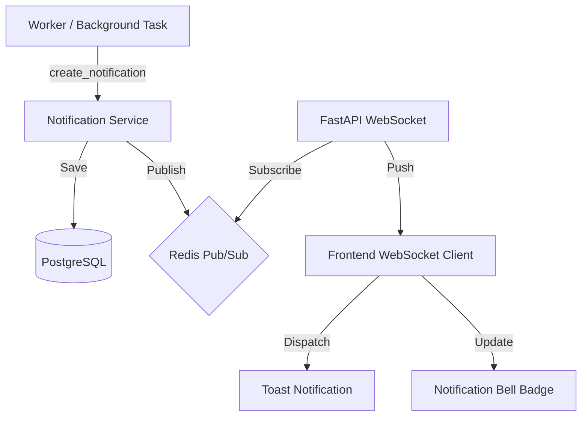

# Real-time Notification & Alert System

VisionArk implements a real-time, scalable notification system designed to provide instant feedback for background agent activities and system alerts.

## 1. Architecture Overview

The system followed a **Decentralized Execution** philosophy, ensuring that background tasks (performed by Workers) can alert the user regardless of which server or process is handling the task.

### Components
- **Backend Model**: PostgreSQL storage for persistent notification history.
- **Notification Service**: Centralized service for CRUD and broadcasting.
- **Redis Pub/Sub**: The backbone for real-time distribution across multiple backend instances.
- **WebSocket API**: Dedicated endpoint for real-time delivery to the frontend.
- **Frontend Context**: React context managing WebSocket state and unread counts.
- **UI Components**: Toast notifications and a Notification Bell (Dropdown).



## 2. Backend Implementation

### Data Model (`Notification`)
Notifications are stored in the database to ensure a persistent history.
- `id`: UUID.
- `type`: `INFO`, `SUCCESS`, `WARNING`, `ERROR`.
- `title` / `content`: Human-readable text.
- `link`: Optional URL or project path for redirection.
- `is_read`: Boolean status.

### Notification Service
Located in `core/backend/services/notification_service.py`. It provides:
- `create_notification`: Saves to DB and publishes to Redis channel `notifications:{user_id}`.
- `list_notifications`: Retrieves history with pagination.
- `mark_as_read`: Updates status.

### Scalability (Multi-server Support)
By using **Redis Pub/Sub**, any backend instance (or even a separate worker process) can trigger a notification. The WebSocket server (FastAPI) subscribes to the user-specific channel and forwards the JSON payload to the connected client.

## 3. Worker Integration

The `Worker` class (`core/backend/worker.py`) is integrated with `NotificationService`. When a node finishes background processing (e.g., skill mining, long-running agent tasks), it automatically emits:
- **Success Notification**: "Agent Work Completed"
- **Error Notification**: "Agent Work Failed"

## 4. Frontend Integration

### NotificationProvider
The `NotificationProvider` (`core/frontend/lib/NotificationContext.tsx`) manages:
- **WebSocket Lifecycle**: Automatic connection on login, reconnection on failure.
- **Unread Counter**: State-tracked count of unread notifications.
- **Dispatching Toasts**: Real-time popups when new messages arrive.

### Audio Alerts & Customization
VisionArk supports customizable audio alerts for notifications, specifically for timers and critical events.
- **Dynamic Selection**: Users can choose from multiple sound presets in the **Settings > General** tab.
- **Preview**: The UI allows testing sounds before saving.
- **Context-Aware Playback**: The `NotificationContext` handles sound resolution based on user preferences stored in `general_settings`.
- **Backend discovery**: Audio files are dynamically loaded from `assets/static/sounds`.

### Notification Bell
The `NotificationBell` component is integrated into:
- The global `Navbar`.
- The `ProjectChatPage` (Project-specific header).
- `MobileLayout` (Mobile header).

It displays the current unread count badge and provides a dropdown to view history and mark items as read.

## 5. Usage Example (Backend)

```python
from services.notification_service import NotificationService
from models.database import NotificationType

service = NotificationService(db_session)
await service.create_notification(
    user_id="user-uuid",
    title="Insight Found",
    content="The agent finished analyzing the documents.",
    type=NotificationType.SUCCESS,
    link="/projects/my-project"
)
```

---
*Last Updated: 2026-01-30*
