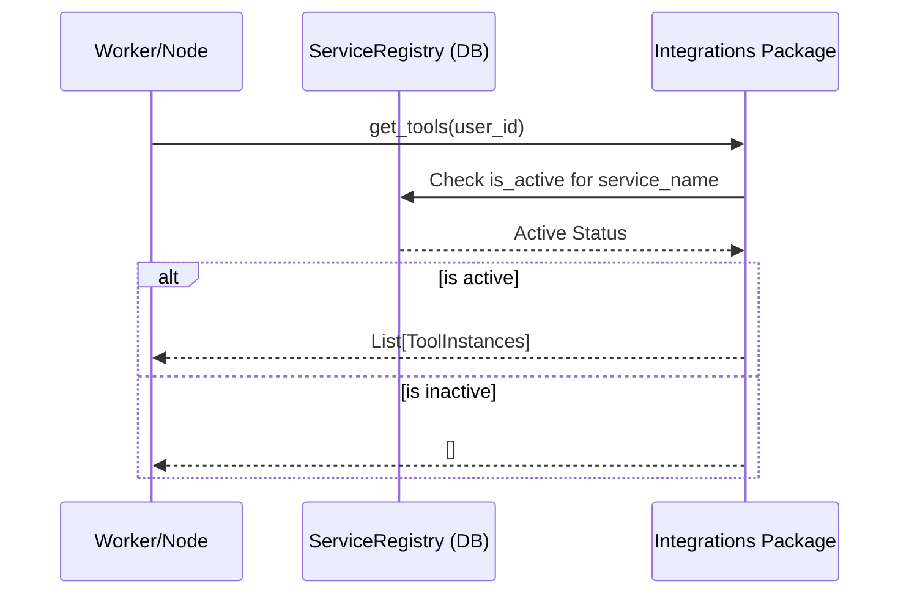

# Integration Architecture: Discovery & Execution

This document explains how VisionArk dynamically discovers and executes tools provided by external integrations.

## 1. Discovery Flow

VisionArk does not hardcode its integrations. Instead, it uses a dynamic discovery mechanism to load only what is needed and active.

### The Registration Chain
1. **Startup**: The `main.py` and `worker.py` call `va_sdk.discovery` functions.
2. **Model Registration**: `discover_integration_models()` scans `integrations/*/models.py` and registers them with SQLAlchemy.
3. **API Mounting**: `include_integration_routers()` scans `integrations/*/api.py` and mounts FastAPI routers.
4. **Tool Discovery (Runtime)**: When an AI Node starts, it calls `get_integration_tools(user_id)`.

### User-Specific Activation
In each integration's `__init__.py`, the `get_tools` function check the `ServiceRegistry` to ensure the integration is active for that specific user before returning any tools.

## 2. Tool Execution Flow

Tools are executed through a "Pre-flight" wrapper in `BaseNode` which handles logging and UI feedback.

1. **LLM Turn**: The LLM requests a tool call (e.g., `search_calendar`).
2. **Orchestration**: `ReasoningEngine` identifies the requested function name.
3. **Execution**: The call is routed through `BaseNode._execute_tool(tool_instance, **args)`.
4. **Context Injection**: The `BaseNode` automatically injects `user_id` and `db_session` into the `kwargs` before calling `tool_instance.run()`.
5. **Feedback**: Status messages (e.g., "Executing search_calendar...") are sent to the frontend via the `status_callback`.

## 3. Key Discovery Utilities

- **`va_sdk.discovery`**: Contains the logic for directory scanning and dynamic module importing (`importlib`).
- **`core/backend/tools/__init__.py`**: Contains the `get_integration_tools` helper used by nodes.

---
> [!IMPORTANT]
> Because discovery happens at runtime, integration packages must be importable without side effects that depend on a strictly ordered global state.
