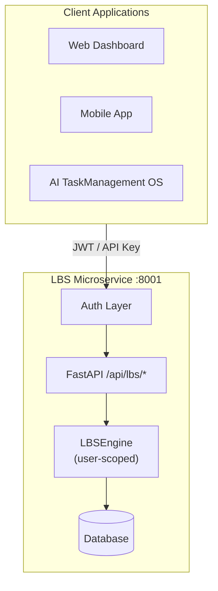
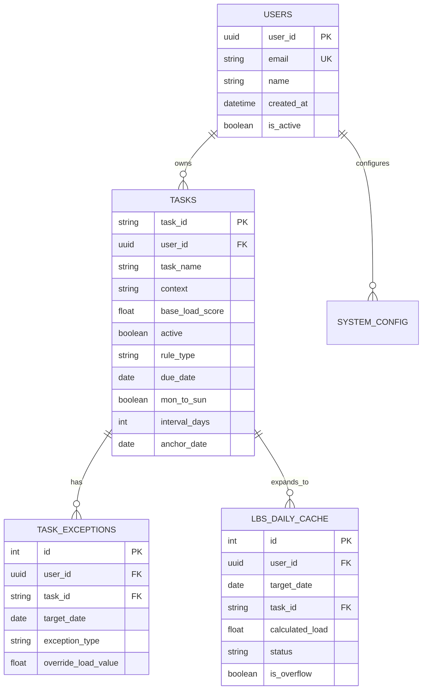

# LBS Microservice System Design
> **Load Balancing System (LBS)** – Multi-User Cognitive Load Management Microservice
---
## 1. Overview
The LBS Microservice is a **standalone, multi-tenant service** for task scheduling and cognitive load management. Designed for business use with complete user data isolation.
### Design Principles
| Principle | Description |
|-----------|-------------|
| **Multi-User** | Complete data isolation per user |
| **Self-contained** | No external dependencies |
| **Stateless API** | JWT/API Key authentication |
| **Portable** | Docker or Python deployment |
---
## 2. Deployment Architecture

---
## 3. User Identification
### Authentication Methods
| Method | Header | Use Case |
|--------|--------|----------|
| **JWT** | `Authorization: Bearer <token>` | Web/Mobile sessions |
| **API Key** | `X-API-Key: <key>` | Service-to-service |
| **User ID** | `X-User-ID: <uuid>` | Dev/Testing only |
### User Model
| Field | Type | Description |
|-------|------|-------------|
| `user_id` | UUID (PK) | Unique identifier |
| `email` | String (UK) | Login email |
| `name` | String | Display name |
| `created_at` | DateTime | Account creation |
| `is_active` | Boolean | Account status |
---
## 4. Data Models
### 4.1 Entity Relationship

### 4.2 Tasks Table (Full Schema)
| Field | Type | Description |
|-------|------|-------------|
| `task_id` | String (PK) | e.g., `T-a1b2c3d4` |
| `user_id` | UUID (FK) | Owner |
| `task_name` | String | Display name |
| `context` | String | Project/Spoke tag |
| `base_load_score` | Float | 0.0 – 10.0 |
| `active` | Boolean | Enabled flag |
| `rule_type` | Enum | Recurrence type |
| `due_date` | Date | For ONCE tasks |
| `mon`–`sun` | Boolean | Weekday flags (WEEKLY) |
| `interval_days` | Int | Days between (EVERY_N_DAYS) |
| `anchor_date` | Date | Recurrence start reference |
| `month_day` | Int | 1-31 (MONTHLY_DAY) |
| `nth_in_month` | Int | 1-5 or -1 (MONTHLY_NTH_WEEKDAY) |
| `weekday_mon1` | Int | 1=Mon...7=Sun |
| `start_date` | Date | Validity start |
| `end_date` | Date | Validity end |
| `notes` | Text | User notes |
| `external_sync_id` | String | MS ToDo ID (future) |
### 4.3 Exception Types
| Type | Behavior |
|------|----------|
| `SKIP` | Cancel task for that date (load = 0) |
| `OVERRIDE_LOAD` | Replace load score with custom value |
| `FORCE_DO` | Add task on non-scheduled date |
### 4.4 User-Specific Configuration
| Key | Default | Description |
|-----|---------|-------------|
| `ALPHA` | 0.1 | Task count coefficient |
| `BETA` | 1.2 | Task count exponent |
| `CAP` | 8.0 | Daily capacity limit |
| `SWITCH_COST` | 0.5 | Context switch penalty |
---
## 5. Core Algorithms
### 5.1 Task Rule Types
| Rule Type | Parameters | Example |
|-----------|------------|---------|
| `ONCE` | `due_date` | Single deadline |
| `WEEKLY` | `mon`–`sun` flags | Every Tue & Thu |
| `EVERY_N_DAYS` | `anchor_date`, `interval_days` | Every 3 days |
| `MONTHLY_DAY` | `month_day` | Every 25th |
| `MONTHLY_NTH_WEEKDAY` | `nth_in_month`, `weekday_mon1` | 3rd Monday |
### 5.2 Expansion Algorithm
Transform task rules into daily cache entries:
```
For each date in [start_date, end_date]:
    1. Period Validation
       - start_date ≤ target_date ≤ end_date
       - task.active == True
    
    2. Rule Matching
       - ONCE: target_date == due_date
       - WEEKLY: weekday flag is True
       - EVERY_N_DAYS: (target - anchor) % interval == 0
       - MONTHLY_DAY: day == month_day
       - MONTHLY_NTH_WEEKDAY: is Nth weekday of month
    
    3. Exception Override
       - SKIP → do not create entry
       - OVERRIDE_LOAD → use exception's load value
    
    4. Create LBSDailyCache entry with user_id
```
### 5.3 Load Calculation Formula
$$
\text{Adjusted} = \text{Base} + \alpha \times N^{\beta} + \text{SWITCH\_COST} \times \max(U - 1, 0)
$$
| Variable | Meaning |
|----------|---------|
| **Base** | Sum of all task load scores for the day |
| **N** | Number of tasks |
| **U** | Number of unique contexts (projects) |
| **α (ALPHA)** | Task count penalty coefficient (default 0.1) |
| **β (BETA)** | Task count penalty exponent (default 1.2) |
| **SWITCH_COST** | Context switch penalty (default 0.5) |
**Example Calculation:**
- 4 tasks with loads [2.0, 3.0, 1.5, 2.5] → Base = 9.0
- N = 4, α = 0.1, β = 1.2 → Count penalty = 0.1 × 4^1.2 ≈ 0.53
- U = 2 contexts → Switch penalty = 0.5 × 1 = 0.5
- **Adjusted Load = 9.0 + 0.53 + 0.5 = 10.03** → CRITICAL
### 5.4 Warning Levels
| Level | Range | Color | Meaning |
|-------|-------|-------|---------|
| SAFE | < 6.0 | 🟢 | Comfortable capacity |
| WARNING | 6.0–8.0 | 🟡 | Approaching limit |
| DANGER | 8.0–CAP | 🔴 | At capacity |
| CRITICAL | > CAP | 🟣 | Overloaded |
---
## 6. API Contract
### User Management
| Method | Path | Description |
|--------|------|-------------|
| POST | `/api/users` | Create user |
| GET | `/api/users/me` | Get current user |
### LBS Endpoints (User-Scoped)
| Method | Path | Description |
|--------|------|-------------|
| GET | `/api/lbs/dashboard` | Weekly dashboard with KPIs |
| GET | `/api/lbs/calculate/{date}` | Daily load calculation |
| POST | `/api/lbs/expand` | Trigger rule expansion |
| GET | `/api/lbs/tasks` | List user's tasks |
| GET | `/api/lbs/tasks/{id}` | Get task details |
| POST | `/api/lbs/tasks` | Create task |
| PUT | `/api/lbs/tasks/{id}` | Update task |
| DELETE | `/api/lbs/tasks/{id}` | Delete task |
| GET | `/api/lbs/heatmap` | Calendar heatmap |
| GET | `/api/lbs/trends` | Weekly trends |
---
## 7. Project Structure
```
LBS/
├── src/
│   ├── main.py
│   ├── config.py
│   ├── auth.py
│   ├── models/
│   │   ├── database.py
│   │   └── user.py
│   ├── services/
│   │   └── lbs_engine.py
│   └── api/
│       ├── routes.py
│       ├── users.py
│       └── schemas.py
├── data/
├── tests/
├── requirements.txt
└── Dockerfile
```
---
## 8. Docker Deployment
```yaml
version: "3.8"
services:
  lbs:
    build: .
    ports:
      - "8001:8001"
    volumes:
      - lbs-data:/app/data
    environment:
      - LBS_SECRET_KEY=${LBS_SECRET_KEY}
      - LBS_DB_PATH=/app/data/lbs.db
volumes:
  lbs-data:
```
---
## 9. Quick Start
```bash
# 1. Setup
cd c:\Users\nh112\programming\project\LBS
pip install -r requirements.txt
# 2. Configure
set LBS_SECRET_KEY=your-secret-key-here
# 3. Run
uvicorn src.main:app --reload --port 8001
# 4. Open docs: http://localhost:8001/docs
```
