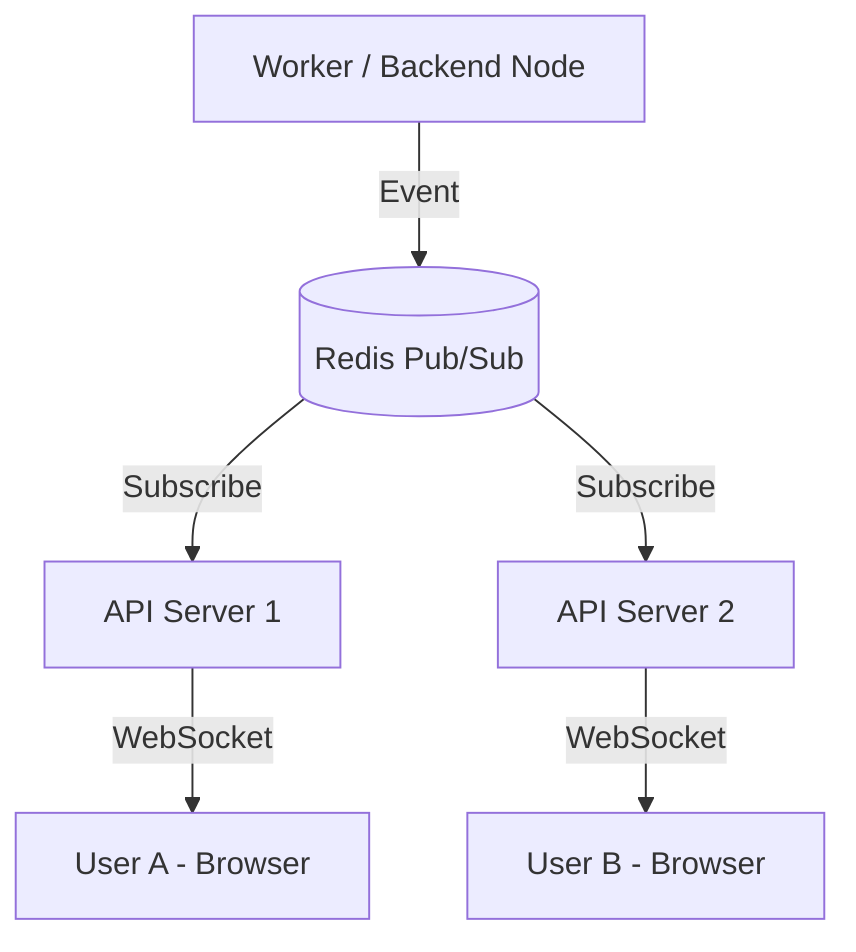

# 通知・アラート機能の実装に向けた調査レポート

本レポートでは、VisionArkへの通知（Notifications）、アラート（Alerts）、タイマー、および時間管理機能の追加に向けた調査結果をまとめます。

## 1. 現在のシステムの実装状況

### バックエンド (Core Backend)
- **チャットベースの通知**: `CallbackService` が実装されており、エージェントの処理完了や失敗時にチャットセッションへメッセージを追記する仕組みがあります。
- **AES (Automated Execution System)**: `AESDispatcher` が `scheduled_tasks` テーブルを監視し、Redisキュー経由で `Worker` にタスクを配信しています。
- **スケジューラ**: `SchedulerService` がタスクの詰め込み（Slotting）やバッファ計算を担当していますが、リアルタイムなアラート機能はまだありません。
- **通知モデルの欠如**: 現在、ユーザーに対する「通知（Notification）」専用の永続化テーブルは存在しません。

### フロントエンド (Core Frontend)
- **通知コンテキスト**: `NotificationContext` が実装されており、トースト通知（`showToast`）や確認ダイアログ（`showConfirm`）を提供しています。
- **表示コンポーネント**: `ToastNotification` と `NotificationDialog` が `RootLayout` に配置されています。
- **リアルタイム通信の欠如**: サーバーからフロントエンドへリアルタイムに情報をプッシュする仕組み（WebSockets/SSE）が現時点では導入されていません。

## 2. 流用可能な既存コンポーネント

- **`scheduled_tasks` テーブル**: タイマーやリマインダーのスケジュール管理にそのまま利用可能です。
- **`AESDispatcher`**: 指定時間になった際に処理をキックする「タイマーの裏側」として流用できます。
- **`NotificationContext`**: フロントエンドでの通知表示ロジックのベースとなります。
- **`CallbackService`**: 通知生成時のトリガーロジックの一部を流用可能です。

## 3. 機能の仕様案

### 通知機能
- **通知の永続化**: 既読/未読状態を管理できる `notifications` テーブルを新設。
- **通知センター**: UI右上に「ベル」アイコンを配置し、過去の通知をリスト表示。
- **リアルタイムプッシュ**: エージェントの処理完了などのイベントを即座にUIへ反映。

### タイマー・時間管理
- **タイマー設定**: エージェントまたはユーザーが「XX分後に通知して」といった指示を出し、AESで管理。
- **アラート**: 指定時刻にブラウザ通知（Web Notifications API）やUI上の目立つアラートを表示。
- **進捗管理**: 長時間のタスクにおいて、一定間隔で中間報告を通知。

## 4. 実装方法

### バックエンドの変更
1. **モデルの追加**: `Notification` モデル（id, user_id, type, content, is_read, link, created_at）を作成。
2. **WebSocket / SSE の導入**: FastAPIでリアルタイム通信エンドポイントを構築。
3. **通知サービスの作成**: データベースへの保存とリアルタイム配信を一括で行う `notification_service.py` を実装。
4. **Workerの拡張**: タスク完了時に `NotificationService` を呼び出すように変更。

### フロントエンドの変更
1. **WebSocketクライアント**: サーバーとの接続を維持し、受信した通知を `NotificationContext` に流し込む。
2. **NotificationBell コンポーネント**: ナビゲーションバー等に配置。
3. **通知リストの取得 API**: 過去の通知をDBからフェッチするAPIとの連携。

## 5. マルチサーバー環境でのスケール戦略

将来的な複数サーバー構成（分散環境）においても、全ノードで整合性の取れたリアルタイム通知を実現するために、**Redis Pub/Sub** を介したメッセージングを採用します。

### アーキテクチャ図

### 連携の詳細
- **ステートレスな接続管理**: 各APIサーバーは、自ノードに接続しているユーザーの情報をメモリ上に保持します。
- **イベントの伝播**: Workerが処理を完了すると、`notifications:{user_id}` チャンネルにイベントをパブリッシュします。
- **フィルタリング**: 全APIサーバーがメッセージを受信しますが、該当するユーザーのWebSocket接続を保持しているサーバーのみが、クライアントへデータをフォワードします。

## 6. UI/UX 仕様案

ユーザーの作業を妨げず、かつ重要な情報を逃さないための通知体験を定義します。

### 通知の階層（タイプ）
1.  **Silent (サイレント)**: 画面上の変化はなく、通知センターにのみ蓄積。
    - 用途: バックグラウンドのマイナーな状態更新。
2.  **Toast (トースト)**: 画面端（右下等）に数秒間表示され、自動で消える。
    - 用途: 「ファイル保存完了」「エージェントが思考中」などの即時確認。
3.  **Alert/Modal (アラート)**: ユーザーの操作を中断し、確認や入力を求める。
    - 用途: エラー発生、承認待ちタスク、タイマーの満了。

### 通知センターの構成
- **アクセス**: ナビゲーションバーの「🔔」アイコンからアクセス。
- **機能**:
    - 未読件数のバッジ表示。
    - 「すべて既読にする」機能。
    - 通知のソース（プロジェクト名、エージェント名）によるフィルタリング。

### タイマー・プログレス管理
- **タイマーウィジェット**: サイドバーまたはヘッダーに残り時間をカウントダウン表示。
- **進捗表示**: 非同期タスクの進捗（0-100%）をリニアなプログレスバーとして表示。完了時にトースト通知へ遷移。

## 7. 変更スコープ (Scope of Change)

| コンポーネント | 変更内容 |
| :--- | :--- |
| **Database** | `notifications` テーブルの追加 (Migration |
| **Backend API** | `/api/notifications` (CRUD), `/ws/notifications` (WebSocket) の追加 |
| **Backend Service** | `NotificationService` の新設, `Worker` の更新 |
| **Frontend lib** | `NotificationContext` の拡張 (WebSocket対応) |
| **Frontend UI** | `NotificationBell` コンポーネントの作成, `Navbar` への統合 |

---
作成日: 2026年1月29日
作成者: VisionArk Investigation Agent
